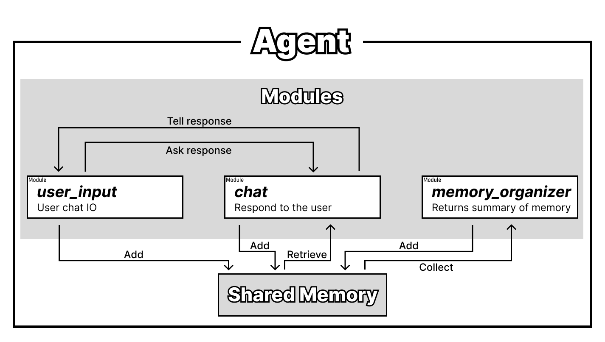

# 3. Creating Modules (CMA Interface)

## Building Your First Modules

In this section, we'll create three simple modules that demonstrate the core concepts of CMA modules. These modules will work together to build a simple chat application that responds to user input.

We'll create the following modules:

1. **`user_input`**: Receives user input and sends it to the `chat` module
2. **`chat`**: Receives messages from the `user_input` module and responds to the user
3. **`memory_organizer`**: Organizes the agent's memory in the background



## Setting Up Your Project

### Create the Project Structure

First, create a directory for your project and agent:

```shell
mkdir -p my_project/agent1
```

### Create Your First Module File

Create a file named `user_input.py` in the `my_project/agent1` directory:

```shell
touch my_project/agent1/user_input.py
```

## Creating the User Input Module

Open `user_input.py` in your text editor and add the following code:

```python
# my_project/agent1/user_input.py
import time
import concurrent_modular_agent as coma

@coma.module_main('user_input')
def mod_user_input(agent: coma.AgentInterface):
    while True:                              # continuously run this module
        m = input("User: ")
        if len(m) == 0 or m.isspace() or m is None:  # if the user input is empty, skip to the next iteration
            continue
        agent.state.add(f"user_message:{m}")
        agent.message.send("chat", "reply to user")  # send message to the "chat" module
        time.sleep(3)                        # wait for 3 seconds before next input
```

This module continuously receives user input. When a user enters a message, it:
1. Adds the message to the agent's **state** (shared memory)
2. Sends a message to the `chat` module to generate a reply

### Understanding the Module Code

Let's examine the key components:

**Module Declaration:**
```python
@coma.module_main('user_input')
def mod_user_input(agent: coma.AgentInterface):
```
The `@coma.module_main(module_name)` decorator creates an `AgentInterface` object with the specified module name. This object provides access to state management and messaging functionality.

**Continuous Operation:**
```python
while True:
    ...
    time.sleep(3)
```
This loop keeps the module running continuously, with a 3-second delay between inputs to prevent overwhelming the user.

**Input Handling:**
```python
m = input("User: ")
if len(m) == 0 or m.isspace() or m is None:
    continue
```
The module captures user input and skips empty or whitespace-only entries.

**State Management:**
```python
agent.state.add(f'user_message:{m}')
```
The **state** is a shared memory space where modules store and retrieve information. Here, we add the user's message with a `user_message:` prefix.

**Inter-Module Communication:**
```python
agent.message.send("chat", "reply to user")
```
This sends a message to the `chat` module, triggering it to generate a response.

## Creating the Chat Module

Create the chat module file:

```shell
touch my_project/agent1/chat.py
```

Add the following code to `chat.py`:

```python
# my_project/agent1/chat.py
import concurrent_modular_agent as coma
from openai import OpenAI

@coma.module_main('chat')
def mod_response_to_user(agent: coma.AgentInterface):
    openai_client = OpenAI()
    while True:
        m = agent.message.receive()
        if m is None:
            continue  # If no message is received, skip to the next iteration
        
        messages = [
            {"role": "developer", "content": "You are a module of an autonomous agent. Your job is to respond to the user's input. You are expected to talk with the user. You are not an AI assistant, so feel free to talk freely. You do not need to help humans. You received the following messages from the user, other modules. Talk to the user in a natural way."},
        ]
        
        for s in agent.state.get(max_count=10).texts[::-1]:
            if s.startswith("user_message:"):
                messages.append({"role": "user", "content": s[len("user_message:"):]})
            elif s.startswith("assistant_message:"):
                messages.append({"role": "assistant", "content": s[len("assistant_message:"):]})
        
        messages.append({"role": "assistant", "content": f"{m}"})

        completion = openai_client.chat.completions.create(
            model="gpt-4o",
            messages=messages,
        )
        
        output_message = completion.choices[0].message.content
        print(f'ChatBot: {output_message}')
        agent.state.add(f"assistant_message:{output_message}")
        
        agent.message.send("user_input", 'chat response finished')
```

### Understanding the Chat Module

**Message-Driven Activation:**
```python
while True:
    m = agent.message.receive()
    if m is None:
        continue
```
The module waits for messages from other modules (like `user_input`) before activating.

**LLM Integration:**
```python
openai_client = OpenAI()
completion = openai_client.chat.completions.create(
    model="gpt-4o",
    messages=messages,
)
```
The module uses OpenAI's API to generate responses.

**State Retrieval:**
```python
for s in agent.state.get(max_count=10).texts[::-1]:
    if s.startswith("user_message:"):
        messages.append({"role": "user", "content": s[len("user_message:"):]})
    elif s.startswith("assistant_message:"):
        messages.append({"role": "assistant", "content": s[len("assistant_message:"):]})
```
The module retrieves recent conversation history from the shared state to provide context to the LLM.

**Response Output:**
```python
output_message = completion.choices[0].message.content
print(f'ChatBot: {output_message}')
agent.state.add(f"assistant_message:{output_message}")
```
The generated response is displayed to the user and stored in the shared state.

## Creating the Memory Organizer Module

Create the memory organizer file:

```shell
touch my_project/agent1/memory_organizer.py
```

Add the following code:

```python
# my_project/agent1/memory_organizer.py
import time
import random
import concurrent_modular_agent as coma
from openai import OpenAI

@coma.module_main('memory_organizer')
def mod_organize_memory(agent: coma.AgentInterface):
    openai_client = OpenAI()
    while True:
        time.sleep(100)  # Wait for 100 seconds between memory organization cycles
        
        messages = [
            {"role": "developer", "content": "You are a module of an autonomous agent. Your job is to organize the memory of the agent. You are expected to organize the memory of the agent in a way that is helpful to recall the past and what the agent had thought. You will be given a list of memory entries from the user and other modules."},
        ]
        
        organizing_range = random.randint(5, 10)  # Randomly decide how many messages to organize
        recent_states = agent.state.get(max_count=organizing_range).texts[-organizing_range:]
        
        for s in recent_states:
            if s.startswith("user_message:"):
                messages.append({"role": "user", "content": s[len("user_message:"):]})
            elif s.startswith("assistant_message:"):
                messages.append({"role": "assistant", "content": s[len("assistant_message:"):]})
        
        completion = openai_client.chat.completions.create(
            model="gpt-4o-mini",
            messages=messages,
        )
        
        output_message = completion.choices[0].message.content
        agent.state.add(f'memory_summary:{output_message}')
```

### Understanding the Memory Organizer

**Background Operation:**
```python
while True:
    time.sleep(100)  # Wait for 100 seconds between cycles
```
This module runs independently in the background, periodically organizing the agent's memory.

**Random Memory Selection:**
```python
organizing_range = random.randint(5, 10)
recent_states = agent.state.get(max_count=organizing_range).texts[::-1]
```
The module randomly selects 5-10 recent memory entries to organize, adding variety to the memory organization process.

**Concurrent Operation:**
The `memory_organizer` module runs concurrently with the other modules. While `user_input` and `chat` modules interact directly with each other, the memory organizer works independently to maintain and organize the agent's memory in the background.

## Next Steps

Now that you've created your three modules, you're ready to run your first CMA agent! Continue to the next section to learn how to execute your agent and see it in action.


<div style="text-align: center; margin: 2rem 0;">
    <a href="../running-the-agent" class="indigo-button">
        🚀 Running the Agent
    </a>
</div>

<style>
.indigo-button {
    display: inline-block;
    padding: 12px 32px;
    background-color: #3F51B5;
    color: #FFFFFF !important;
    text-decoration: none !important;
    border-radius: 6px;
    font-weight: 600;
    font-size: 16px;
    box-shadow: 0 3px 6px rgba(63, 81, 181, 0.25);
    transition: all 0.2s ease;
    border: none;
}

.indigo-button:hover {
    background-color: #303F9F;
    box-shadow: 0 4px 8px rgba(63, 81, 181, 0.35);
    transform: translateY(-1px);
    color: #FFFFFF !important;
    text-decoration: none !important;
}

.indigo-button:visited {
    color: #FFFFFF !important;
}

.indigo-button:active {
    color: #FFFFFF !important;
}
</style>
